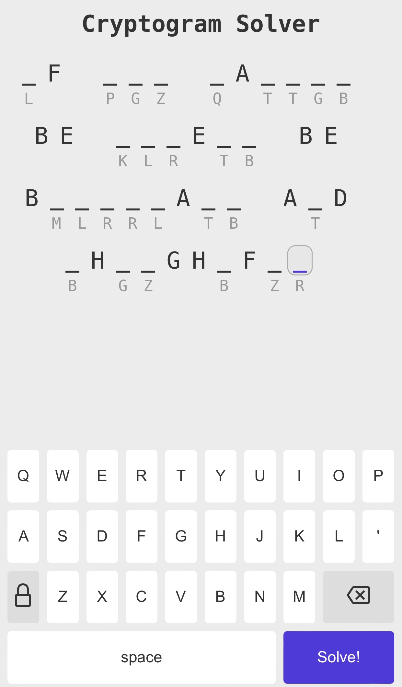
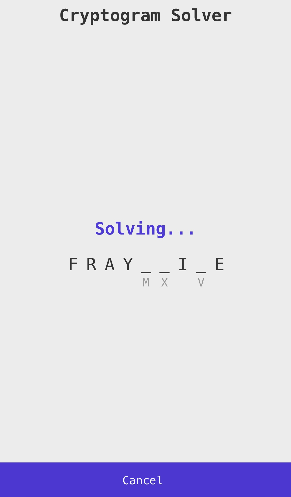
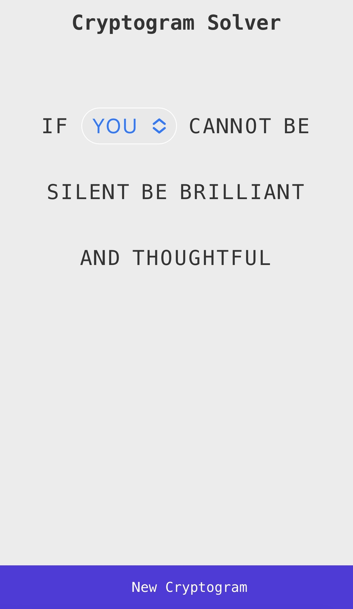

# CryptogramSolver

CryptogramSolver offers an interface to solve cryptograms from the [Cryptogram](https://apps.apple.com/tr/app/cryptogram-decrypt-quotes/id1549190465) app.  
It uses a custom made server and solving algorithm.

## Usage

To use the application start by downloading the [Server](https://github.com/SimonRobs/CryptogramSolver_Server). Follow installation instructions and run the server.  
Then, follow these steps:

1. Clone this repository
2. Find your IP and change the IP to your computer's local IP in [`/CryptogramSolver_Client/src/app/constants.ts`](./src/app/constants.ts)
3. On a terminal, run
    ```
    yarn install
    yarn dev
    ```
4. Open a browser and navigate to: `http://<YOUR_IP>:4200`

## Screenshots




